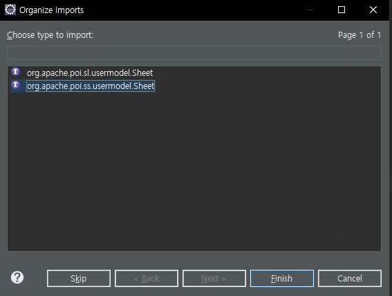
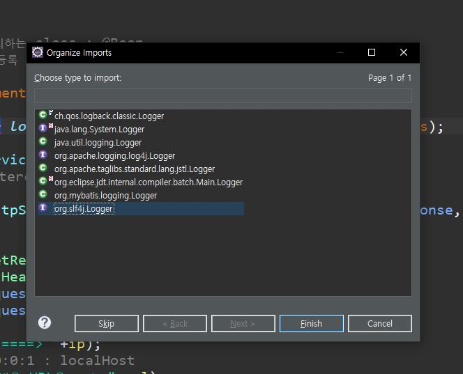
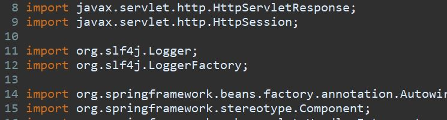

# Excel

- 사진 파일 등등 다운받는건 리턴타입이 없음  
= void or ResponseEntity response라는 객체가 있음  
페이지 이름으로 리턴하면 안됨!

```java
@Controller 
public class ExecelController {
	@Autowired
	private ExcelService excelService;
	@GetMapping("/excel")
	public void downloadExcelFile(HttpServletResponse response) throws Exception
}
```
## service 
- import할 때 선택지가 2가지 뜸 'ss'로 선택



- 다운받은 엑셀파일 스타일 수정도 가능  
단 헤드와 바디 따로 


---
# Logger
- 실무에선 systemout이 아닌 logger로 확인
- 조회 시간까지 모두 log로 기록됨
```java
// interceptor

private static final Logger logger = LoggerFactory.getLogger(Interceptor.class);

		logger.info("Hello World");
		logger.info("client IP : "+ip);
		logger.info("request URL : "+url);
		logger.info("request HTTPMethod : "+httpMethod);

```
- import시 org.slf4j.Logger선택  
만약 에러 해결 안될 시 밑에 import 동일하게 쓰기



