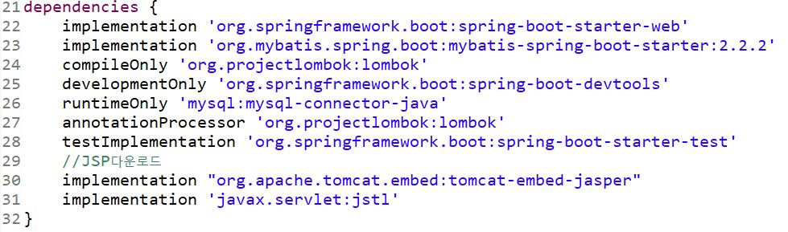
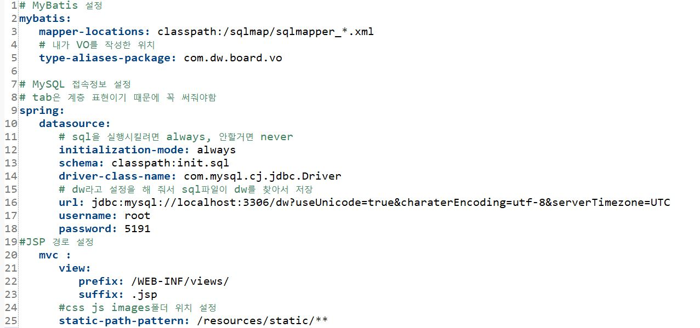

# JSP
## Java Server Page
- JSP는 템플릿 엔진으로 html안에서 java코딩이 가능한 파일 생성
- 이클립스같은IDE에서만 사용가능하기 때문에  
퍼블리셔는 html로 개발하고 백엔드에서 JSP로 변경하면 됨  

if, else
```jsp
if 
    <c:if test="if문 조건"></c:if>
if else
    <c:choose>
		<c:when test="if문 조건"> if </c:when>
		<c:otherwise> else </c:otherwise>
	</c:choose>
```
for-each
```jsp
java
for(int i : array) {  }

jsp
<c:forEach items="${array}" var="index"></c:forEach>
```


---
## controller
- @Controller 사용
- return JSP파일명
```java
@GetMapping("/home")
	public String loadHomePage(ModelMap map) {
        map.addAttribute("key", "value");
        map.addAttribute("key", value);
		return "index";
	}
```
---
# JSP 설치

1. project 우클릭 -> new -> source Folder ->  
folderName : src/main/webapp
2. src/main/webapp 우클릭 -> new -> other -> general -> Folder  
folderName : WEB-INF 
3. WEB-INF 우클릭 -> new -> Folder ->  
folderName : views 
4. views 우클릭 -> new -> other -> web -> JSP File ->  
fileName : index
5. bulid.gradle에 붙여넣기 -> refresh
```gradle
	//JSP다운로드
	implementation "org.apache.tomcat.embed:tomcat-embed-jasper"
	implementation 'javax.servlet:jstl'
```

-  refresh 하고 webapp폴더가 없어져도 src -> main -> webapp이 있음
6. yaml파일에 jsp경로 설정
```yaml
#JSP 경로 설정
   mvc :
      view:
         prefix: /WEB-INF/views/
         suffix: .jsp
```
7. src/main/resources -> static폴더에 css, images, js폴더 만들기  
8. js 폴더 -> 우클릭 -> new -> file ->  
fileName : index.js
9. yaml파일에 css, images폴더 경로 설정
```yaml
      #css js images폴더 위치 설정
      static-path-pattern: /resources/static/** 
```

10. jsp파일에 js파일 경로 설정
```jsp
<script type="text/javascript" src="/resources/static/js/index.js"></script>
```
---
# OTHER

- for-each  
1. 조건식 생략가능  
2. 변수에 바로 대입 됨  
3. 데이터타입이 중요
```java
int array[] = {10,20};

// for
	for (int i=0; i<array.length; i++) {
		int x = array[i];
		System.out.println(x);
		}
// for-each
		for(int i : array) {
        // for문 array[i] = for-each문 i
			System.out.println(i);
		}

// 결과는 동일
```
```java
    List<Pizza> pizzaList = new ArrayList<Pizza>();
		Pizza p1 = new Pizza();
		p1.pizzaMoney = 1000;
		p1.pizzaName = "불고기피자";
		
		Pizza p2 = new Pizza();
		p2.pizzaMoney = 2000;
		p2.pizzaName = "페퍼로니피자";
		
		pizzaList.add(p1);
		pizzaList.add(p2);
    
    for(Pizza p : pizzaList) {
			System.out.println(p.pizzaMoney);
			System.out.println(p.pizzaName);
		}
```

