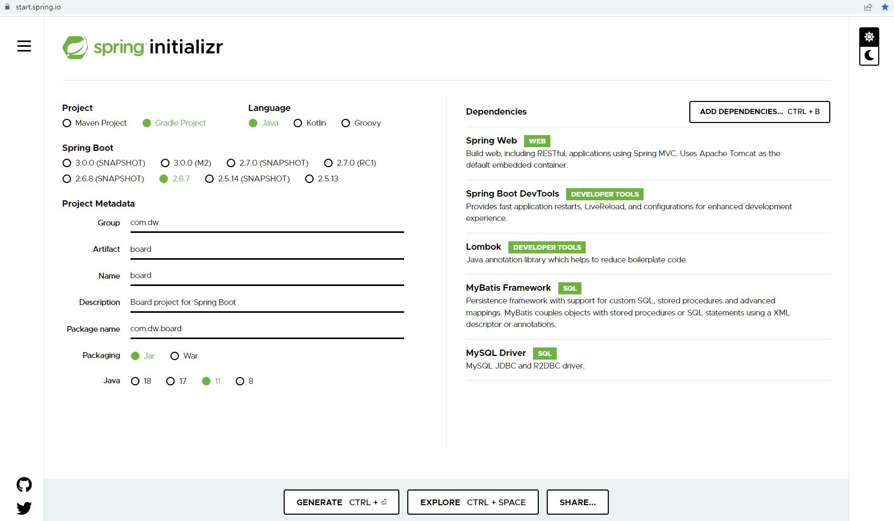

## Spring project생성
1. https://start.spring.io/  


2. spring_workspaces -> zipFile옮기고 여기에 압축풀기
3. eclipse -> file -> import -> 경로지정
4. properties 확장자명 -> yaml로 수정
5. salmap 패키지 생성
6. sqlmapper.xml 생성
7. banner(option), logback (query결과 뜨는 것) 추가
8. MVC package -> class파일 생성
---
# JSP
- html안에서 java코딩이 가능한 파일 생성
- 이클립스같은IDE에서만 사용가능하기 때문에  
퍼블리셔는 html로 개발하고 백엔드에서 JSP로 변경하면 됨

---
# JSP 설치

1. project 우클릭 -> new -> source Folder ->  
folderName : src/main/webapp
2. src/main/webapp 우클릭 -> new -> other -> general -> Folder  
folderName : WEB-INF 
3. WEB-INF 우클릭 -> new -> Folder ->  
folderName : views 
4. views 우클릭 -> new -> other -> web -> JSP File ->  
fileName : index
5. bulid.gradle에 붙여넣기 -> refresh
```gradle
	//JSP다운로드
	implementation "org.apache.tomcat.embed:tomcat-embed-jasper"
	implementation 'javax.servlet:jstl'
```

-  refresh 하고 webapp폴더가 없어져도 src -> main -> webapp이 있음
6. yaml파일에 jsp경로 설정
```yaml
#JSP 경로 설정
   mvc :
      view:
         prefix: /WEB-INF/views/
         suffix: .jsp
```
7. src/main/resources -> static폴더에 css, images, js폴더 만들기  
8. js 폴더 -> 우클릭 -> new -> file ->  
fileName : index.js
9. yaml파일에 css, images폴더 경로 설정
```yaml
      #css js images폴더 위치 설정
      static-path-pattern: /resources/static/** 
```

10. jsp파일에 js파일 경로 설정
```jsp
<script type="text/javascript" src="/resources/static/js/index.js"></script>
```
---
# eclipse에서 table생성
```
학생게시판 만들기

table : 
- 학생 
번호
이름
패스워드

- 게시판
제목
내용
작성자
수정날짜
최초게시날짜

둘의 관계는 1:n의 관계
```
1. src/main/resources 우클릭 -> other -> General -> file ->  
fileName : init.sql
```sql
-- sql파일 여기서 table작성
-- CREATE TABLE IF NOT EXISTS : 이 테이블이 존재하지 않는다면 생성해라
-- DDL autocommit
CREATE TABLE IF NOT EXISTS students( -- 학생 테이블
	students_id INTEGER(4) AUTO_INCREMENT NOT NULL PRIMARY KEY COMMENT '학생 아이디',
    students_name VARCHAR(20) COMMENT '학생 이름',
    students_password VARCHAR(200) COMMENT '학생 비밀번호', -- 우리가 암호화해서 저장하기 때문에 글자수 제한을 크게 해야함
    create_at DATETIME DEFAULT CURRENT_TIMESTAMP COMMENT '가입 날짜' -- insert할때 입력 안하면 디폴트로 현재시간을 넣어 주겠다
)ENGINE=InnoDB DEFAULT CHARSET=utf8mb4;

CREATE TABLE IF NOT EXISTS board -- 게시판 테이블
( 
    board_id INTEGER(4) AUTO_INCREMENT NOT NULL PRIMARY KEY COMMENT '게시판 아이디',
    students_id INTEGER(4) COMMENT '학생 아이디',
    title VARCHAR(50) COMMENT '제목',
    content VARCHAR(100) COMMENT '글 내용',
    update_at DATETIME COMMENT '수정 날짜',
    create_at DATETIME DEFAULT CURRENT_TIMESTAMP COMMENT '작성 날짜',
    CONSTRAINT board_students_id_fk FOREIGN KEY (students_id) REFERENCES students(students_id)
)ENGINE=InnoDB DEFAULT CHARSET=utf8mb4;
-- run할 때 이 파일을 실행시킬지 결정은 yaml에서 함
-- DDL을 스키마라고 함
```
- mybatis시작 할 때 DB의 경로를 dw로 해 주었기 때문에 생성된 테이블은  
dw에 저장되어있음
- 만약 dw테이블이 존재하지 않는다면
```sql
-- 만약 dw라는 database가 존재하지 않는다면 이렇게 생성
-- 지금 이 CREATE에서는 대소문자 구분 안함
CREATE database IF NOT EXISTS DW DEFAULT CHARACTER SET utf8 COLLATE utf8_general_ci;
USE DW; -- 데이터베이스를 만들면 이걸 사용할 거라고 말하는거 
```