# eclipse 와 github 처음 연동 방법
## 1. eclipse projectName과 똑같은 repositoies 생성  

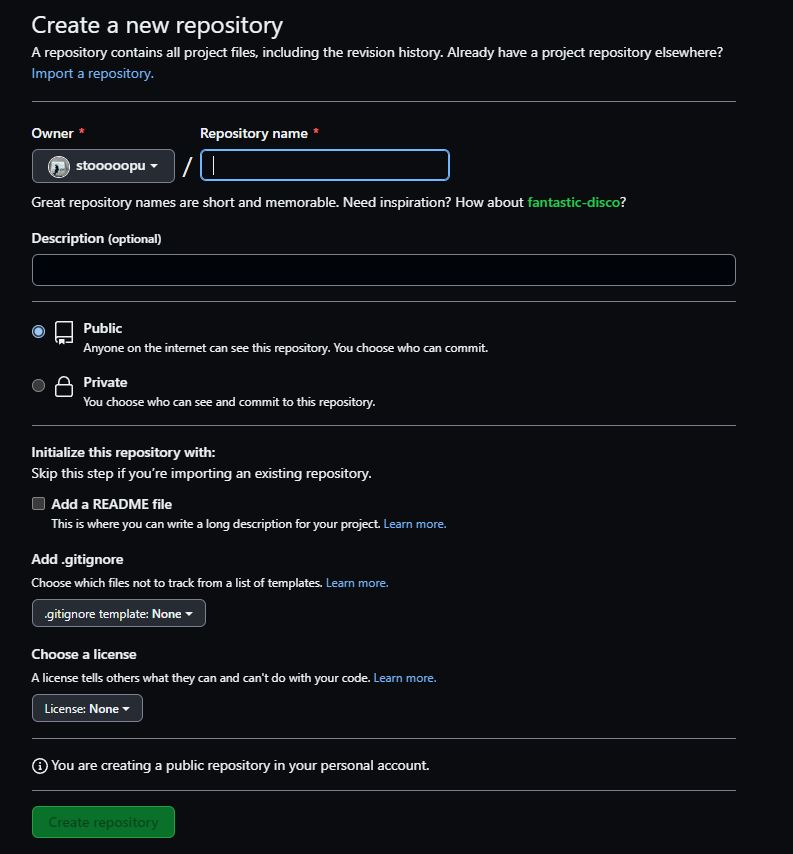

## 2. projectName 우클릭 -> Team -> Share Project  

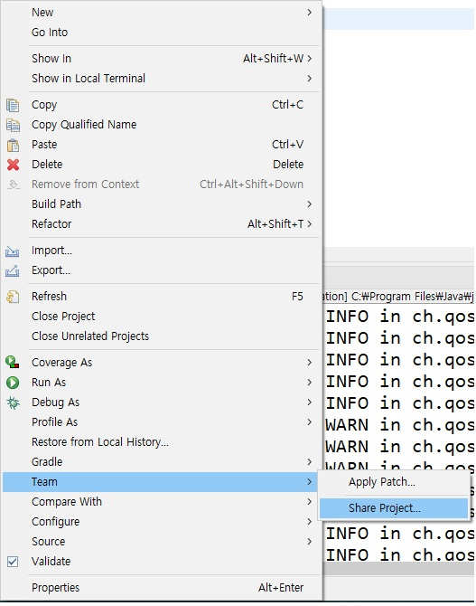

## 3. 빈 체크박스 모두 체크 -> Finish

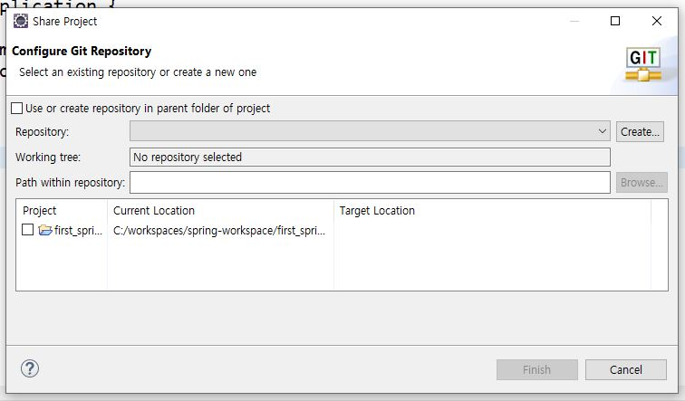   

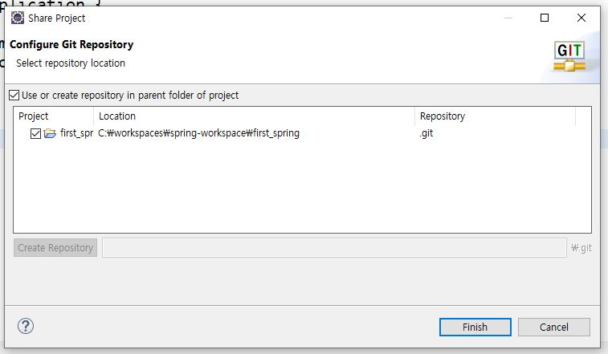  
  
## 4. gitRetositoies에 들어갔는지 확인  
## 아직 branch는 정해지지 않아서 Remotes는 비어있음  

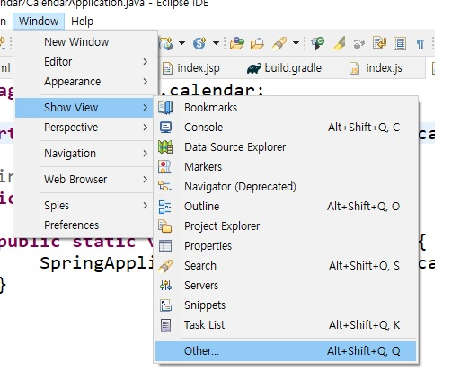  

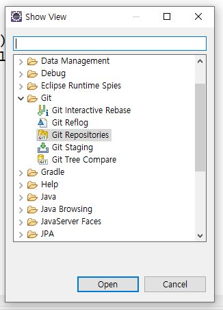  

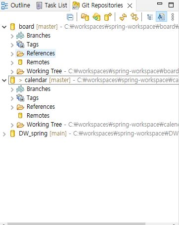   

board-Remotes와 calendar-Remotes비교  
## 5. 오른쪽 상단 git눌러서 들어가기  
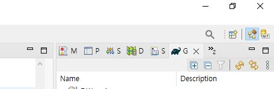  
## 6. Remotes우클릭 -> Create Remote  

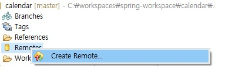  

## 7. Create -> Cgange클릭 -> URL에 연동할 repositories주소 붙여넣기  
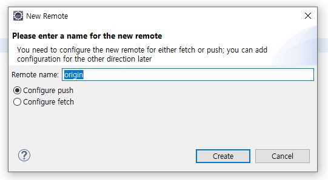  
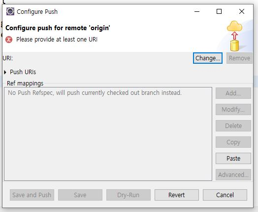  
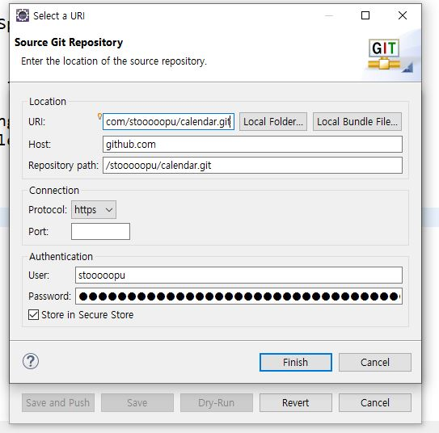  
## 8. 업로드 할 파일 클릭 후 + 눌러서 추가 후 Commit and Push... 클릭  
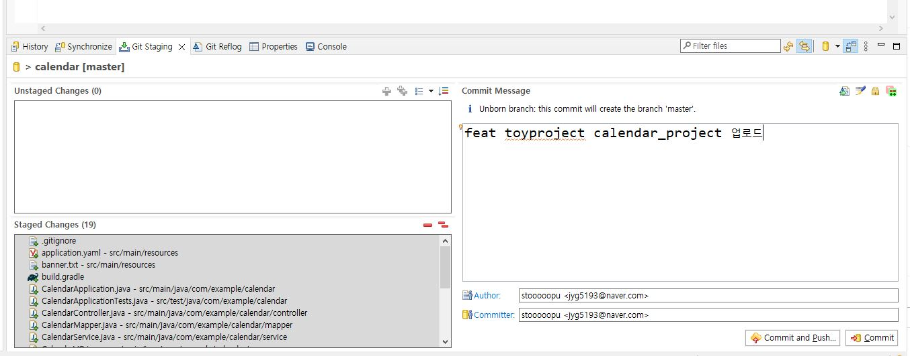  
## 9. Preview 클릭  
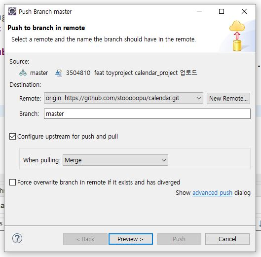  
## 10. Push 클릭  
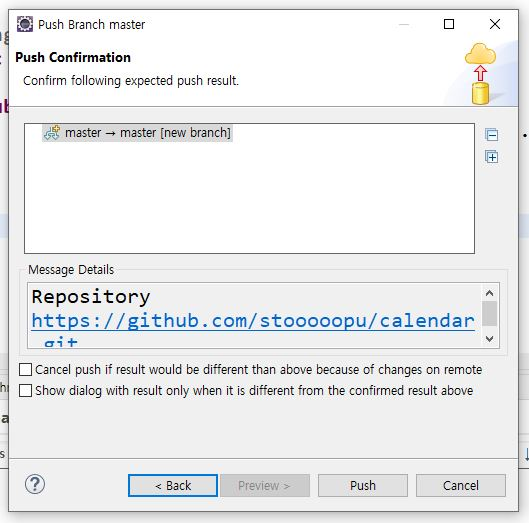  
## 11. 완료  
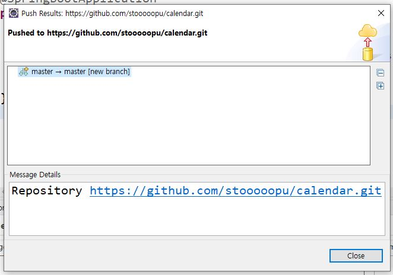  