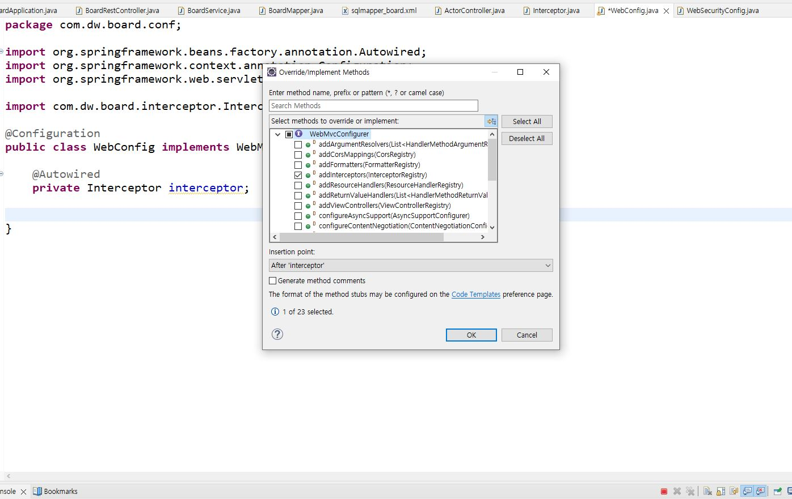

# ip
- ip log남기기  
Spring에서 사용자가 요청(URL)을 서버에 보낼 때마다 중간에 요청을 가로챌 수 있음  
(요청이 controller에 도착하기 전에 가로챔) => interceptor

---
## 1. package : com.dw.board.interceptor 생성
## 2. class : Interceptor 생성
```java
package com.dw.board.interceptor;

import org.springframework.web.servlet.HandlerInterceptor;

@Component
public class Interceptor implements HandlerInterceptor{
}
```


전체선택 -> 생성

```java
package com.dw.board.interceptor;

import javax.servlet.http.HttpServletRequest;
import javax.servlet.http.HttpServletResponse;

import org.springframework.stereotype.Component;
import org.springframework.web.servlet.HandlerInterceptor;
import org.springframework.web.servlet.ModelAndView;

@Component
public class Interceptor implements HandlerInterceptor{
// ** controller에 도착전에 intercept하는 함수
	@Override
	public boolean preHandle(HttpServletRequest request, HttpServletResponse response, Object handler)
			throws Exception {
		
		String url = request.getRequestURI();
		String ip = request.getHeader("X-forwarded-For");
		if(ip == null) ip = request.getRemoteAddr(); 

		System.out.println("IP ====> "+ip);
		System.out.println("요청받은 URL은 ==> "+url);
		
		return true;
	}

	@Override
	public void postHandle(HttpServletRequest request, HttpServletResponse response, Object handler,
			ModelAndView modelAndView) throws Exception {
		
	}

	@Override
	public void afterCompletion(HttpServletRequest request, HttpServletResponse response, Object handler, Exception ex)
			throws Exception {
		
	}
}
```

1. Bean  
스프링이 관리하는 클래스
2. @Bean  
spring에서 제공하고 spring에서 관리하는 class
3. @Component  
내가 생성하고 spring에게 Bean으로 등록 해달라는 class

---

## 3. package : com.dw.board.conf 에 class : WebConfig 생성

```java
package com.dw.board.conf;

import org.springframework.beans.factory.annotation.Autowired;
import org.springframework.context.annotation.Configuration;
import org.springframework.web.servlet.config.annotation.InterceptorRegistry;
import org.springframework.web.servlet.config.annotation.WebMvcConfigurer;

import com.dw.board.interceptor.Interceptor;

@Configuration
public class WebConfig implements WebMvcConfigurer {

	@Autowired
	private Interceptor interceptor;	
}
```



```java
package com.dw.board.conf;

import org.springframework.beans.factory.annotation.Autowired;
import org.springframework.context.annotation.Configuration;
import org.springframework.web.servlet.config.annotation.InterceptorRegistry;
import org.springframework.web.servlet.config.annotation.WebMvcConfigurer;

import com.dw.board.interceptor.Interceptor;

@Configuration
public class WebConfig implements WebMvcConfigurer {

	@Autowired
	private Interceptor interceptor;

	@Override
	public void addInterceptors(InterceptorRegistry registry) {
		registry.addInterceptor(interceptor); // 우리가 만든 interceptor를 spring에 등록
	}
}
```