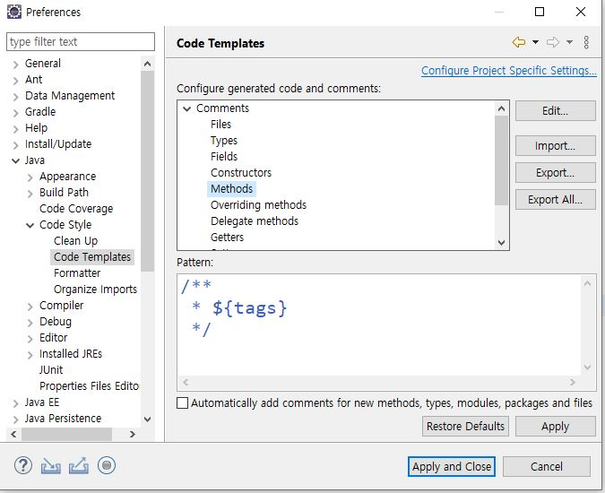

# resultMap
- 두개의 table을 하나의 class에서 join
```java
// VO.java

public class EmpVO {
	private int empno;

    *** join할 table변수선언 ***
	private DeptVO deptVo;
}

public class DeptVO {
	private int deptno;
}
```
```xml
<!--sqlmapper.xml-->

	<resultMap type="DeptVO" id="DeptVO">
		<result column="deptno" property="deptno"/>
	</resultMap>
	<resultMap type="EmpVO" id="EmpVO">
		<result column="empno" property="empno"/>
        *** 변수로 선언한 table ***
		<collection property="deptVo" resultMap="DeptVO"/>
	</resultMap>
```
```xml
    <resultMap type="dateType" id="className">
		<result column="columnName" property="변수이름"/>
	</resultMap>
	
    <resultMap type="dateType" id="className">
        <result column="columnName" property="변수이름"/>
        <collection property="vo에선언한 변수이름" resultMap="join할 className"/>
    </resultMap>   
```

---
# error
```
	public int getEmpUpdateCount(EmpVO vo) { 
		int rows = empMapper.updateEmp(vo);

		UserVO user = null;
		String name = user.getName();
		System.out.println(name);

		return rows;
	}
```
1. UserVO user = null이기 때문에 user.getName = null  
2. System.out.println(name) => null error
3. 오류는 났지만 update는 실행 된 상태

## error 404
1. 없는 url 입력
2. url 오타
3. @RestController or @Controller 어노테이션 입력x

## error 405 
- http 메소드 불일치
	- ex) get 인데 post로 데이터 전송

## error 500
- 백엔드에서 error
1. java 코딩 잘못
```
  ex) 배열길이가 10인데 11번째 인덱스 호출
       쿼리 오타
       쿼리 결과 List인데 List로 안 받을 때
```
## error 403 
- 권한 에러

---
# 주석 수정
- workspaces를 처음 바꾸었을 때 수정
- window -> preperences

- Edit
```
/**
 * ${tags}
 * @author : ji_U
 * @date : ${date}
 * comment :
 */
```
- MetodName을 클릭 한 상태에서 __Art + shift +J__