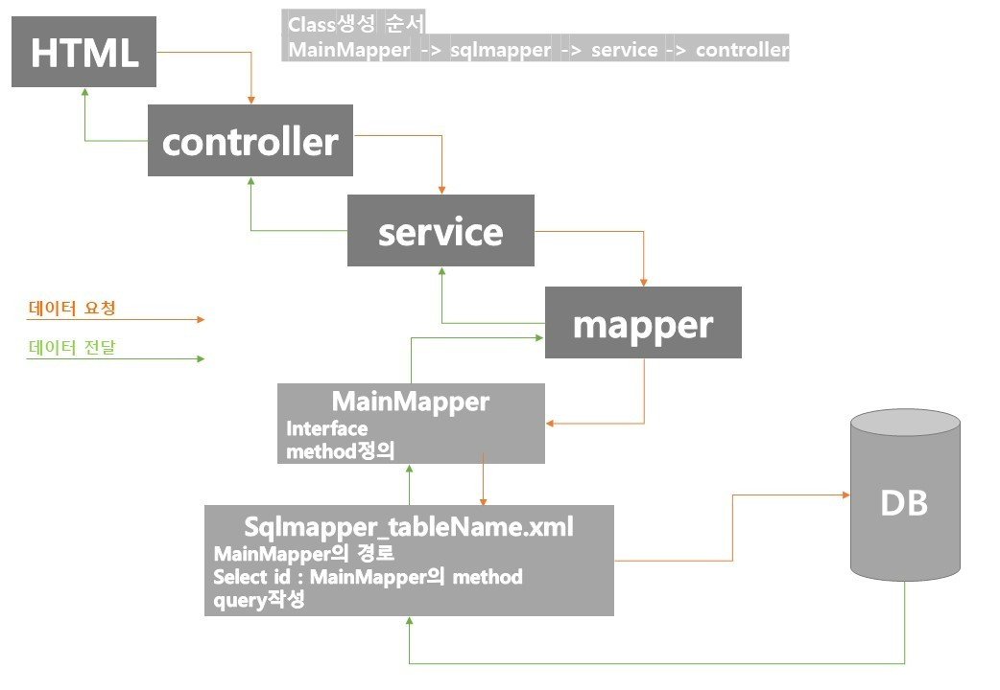

# Spring 하고 함께 사용하는 도구
사용이유  
Spring만으로 어플리케이션을 개발하는데 한계  
DB, 고객에게 보여줄 화면 등등 필요  
java를 도와주는 program들임  

## 1. **ORM  
 Object Relational Mapping
 객체가 테이블이 되도록 매핑시켜주는 프레임워크    
 DB연결과 데이터 생성, 호출, 삭제, 수정을 도와줌 
- MyBatis (v)
- JPA 

## 2. Bulid Tool  
 각 라이브러리들을 번거롭게 다운 받을 필요없이,  
 필요한 기능을 쉽게 다운받고, 서버에 업로드(배포)를 도와주는 빌드관리도구  
 bulid = 프로젝트에서 작성한 코드, 파일들을 인식할 수 있도록 패키징  
- Gradle (v) 
- Maven

## 3. 화면을 도와주는 템플릿 엔진 (html 개념)  
(요새는 백엔드와 프론트를 구분하는 추세라 점점 없어지는 추세)
- JSP
- Thymeleaf (v)

## 4. 속성 정의를 담당하는 속성 파일  
(속성 : DB주소, 아이디, 비번)  
- yaml (v)
- properties 

## 5. 서버를 담당하는 
- Tomcat

## 6. (optional) 그 외 
- Docker
- GraphQL 

---
# src/main/resources
- 자바 외 다른 파일들을 저장
    - html, css, img, js ...

---
## yaml
- springboot부터는 알아서 연결해 주지만 spring, egove는 따로 연결 해 줘야함  
- 따로 다운받는 것이 아닌 이클립스안에 __src/main/resources__ 안에 디폴트로 __properties__ 가 들어있음 -> 확장자명을 yaml로 바꿔주기  
- eclipse -> Help -> Eclipse Marcketplace -> find : yaml -> install -> restart
```
application.yaml

# MyBatis 설정
mybatis:
   mapper-locations: classpath:/sqlmap/sqlmapper_*.xml
   type-aliases-package: com.example.first_spring.vo
   
# MySQL 접속정보 설정
spring:
   datasource:
      driver-class-name: com.mysql.cj.jdbc.Driver
      url: jdbc:mysql://localhost:3306/dw?useUnicode=true&charaterEncoding=utf-8&serverTimezone=UTC
      username: root
      password: 5191
```
※properties는 경로를 계속 적어줘야하는 번거로움이 있어서 yaml사용
- sqlmapper_*.xml : xml의 모든 파일 명의 sqlmapper_ 은 동일  
때문에 모든 파일을 조회 하기 위해 *를 사용
- type-aliases-package: 내가 VO를 작성한 package
- MySQL 접속정보 설정에서 tab은 계층표현이기 때문에 필수
- sql에서 username 찾기 : mySQL -> localhost 우클릭 -> Edit connection에서 확인 가능
- 주석은 #로 표시  
---
## mybatis
- packageName : sqlmap  
new -> other -> XML -> xmlfile -> createFile
- fileName : sqlmapper_tableName.xml  
```
sqlmapper_tableName.xml


<!DOCTYPE mapper PUBLIC "-//mybatis.org//DTD Mapper 3.0//EN" "http://mybatis.org/dtd/mybatis-3-mapper.dtd">
<mapper namespace="MainMapper의 경로">


</mapper>

```
- mapper안에 query작성
```
<select id="MainMapper_mehodName" resultType="returnType">
		SELECT
			*
		FROM  tableName
	</select>
```
- SQLquery와 동일하게 작성



Client(HTML) -> Controller ->Service -> Mapper  
- 프리젠테이션계층 : controller에서 나온 결과화면  
- 비즈니스계층 : service
- 퍼시스턴스계층 : Mapper(DAO)

### if
- test : if문 괄호
- 나중에 테스트가 힘들기 때문에 잘 사용하지 않음
---
# postman
- 프론트개발자와 소통
- google postman검색 -> 사양에 맞게 다운로드 -> sign in
- workspaces -> My workspaces -> collection -> new -> collection  
-> Add Request -> name, url입력 (ex) http://localhost:8080/emp )  
=> 결과 확인

---
# auto_reloade
이걸 편하게 reloade 해주는 도구  
검색 : __devtools gradle__  
 _Spring server reload_  

```
compileOnly("org.springframework.boot:spring-boot-devtools") 
```
복사 후  
이클립스에 _코끼리아이콘_ build.gradle더블클릭  
dependencies {　}안에 붙여넣고   뒤에 이 문장이 어떤건지 주석달기   
그리고 build.gradle오른쪽클릭 -> gradle -> refresh gradle project 클릭  
=> 다운완료
