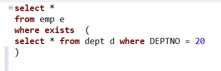
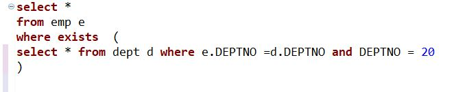
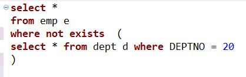
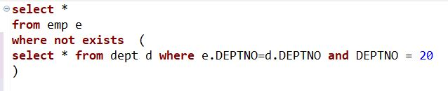

# EXISTS
- where절에 가능  
```sql
SELECT  ename  
FROM emp  
WHERE EXISTS (  
SELECT  *  
FROM emp  
WHERE job = 'manager'  
)
```
subquery에 데이터가 있으면 참 = 실행  
subquery에 데이터가 없으면 거짓 = 실행 안함  

=>위에 결과는 job = 'manager'는 데이터가 있으므로 ename결과 출력  
subquery는 데이터의 존재 여부만 중요 그래서 subquery의 select는 중요하지 않음  

  

dept테이블에 DEPTNO=20 데이터 존재 -> 괄호 밖 select * 모두 실행

  

서브쿼리 안 where절에 e.DEPTNO = d.DEPTNO 조건 추가 = join과 같은 개념  
emp테이블에 DEPTNO=20인 모든 데이터 출력

---
# NOT EXISTS
- where절에 가능  
```sql
SELECT  ename  
FROM emp  
WHERE EXISTS (  
SELECT  *  
FROM emp  
WHERE job = 'manager'  
)  
```
subquery에 데이터가 있으면 실행 안함  
subquery에 데이터가 없으면 실행  
=>위에 결과는 job = 'manager'는 데이터가 있으므로 출력 안함  

  

dept테이블에 DEPTNO=20 데이터 존재  
-> not exists이기 때문에 select절이 출력되지 않음

  

서브쿼리 안 where절에 e.DEPTNO=d.DEPTNO 조건 추가 = join과 같은 개념  
emp테이블에 DEPTNO=20을 제외한 모든 데이터 출력

### subquery 데이터 여부에 따라 실행 판단
### 두가지 모두 update시 많이 사용
- ex) 
```sql
-- 은행 입출금내역  
update 백업실행  
set 백업날짜 = '220222'  
where exists  
(  
select * from 입출금내역  
)
```