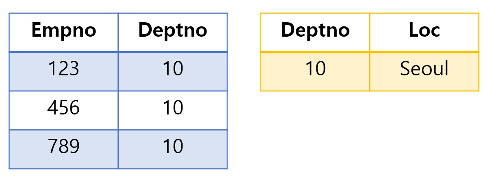

# Join
## inner join
- 2개 이상 테이블 데이터를 조회 할 때 사용, form 의 연장선
- 조회하고자 하는 table끼리 관계가 있어야 함
```
  SELECT 
        *  
  FROM emp AS e  
  INNER JOIN dept AS d  
  ON e.deptno = d.deptno
```

- blue테이블과 yellow테이블의 공통 컬럼 deptno로 조인  


- 둘의 공통 deptno는 10번


- 결과

---
## outer join
- 두 테이블을 조회시, 한 개의 테이블에만 데이터가 있어도 조회
- left join : 왼쪽 테이블의 모든 값 출력
- right join : 오른쪽 테이블의 모든 값 출력
- full join : 양쪽 모든 테이블의 모든 값 출력
---
## self join
- 한 개의 테이블 안에서 본인과 조인
- 별도의 문법은 없음 (자신안에서 교집합을 찾아 조인)
---
## 다중 join
- 첫 번째 join부터 실행
- 별칭은 중복되지 않으므로 잘 나눠야 함
---
## NULLABLE => 해당 컬럼에 null값이 올 수 있는지를 알려주는 것  

  
```
right join food f  
on e.FOODNO = f.FOODNO  
```
=>이때 right의 기준은 무조건 food  
왼쪽의 기준은 밑에 on에서 알 수 있음  
food가 무조건 오른쪽이니까 왼쪽은 emp가 됨  

  
```
right join food f  
on f.FOODNO = e.FOODNO  
```
=> 위와 동일하게 오른쪽은 무조건 food임  
그래서 on 조건에 오른쪽이 emp가 들어간 건 상관 없음  
단순히 food와 emp의 동일한 컬럼을 알려주기 위한 것이니까

## SELF JOIN
- 한 테이블에서 두 칼럼이 연관 관계가 있음