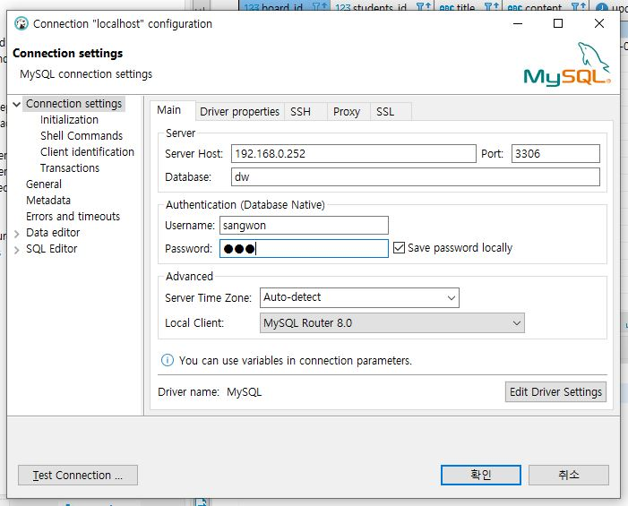
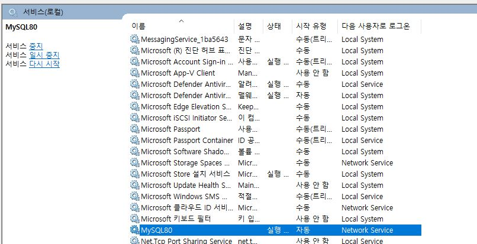

# 다른 사람 DB접속
### 계정 생성
```sql
-- root 계정만 다른 계정을 생성할 수 있음
-- '%' : 어떤 PC등 접속이 가능하게 만들겠다
create user stopu@'%' identified by '12345';
```

1. sever host : 접속하려는 private ip입력
2. user name에 위에서 생성한 DB id 와 password입력 -> 접속

---
제공하려는 서비스가 실행되고 있는지 확인해야함  
윈도우검색창 -> 서비스 검색 -> 서비스 클릭하면 실행되고 있는 서비스 목록이 뜸  

