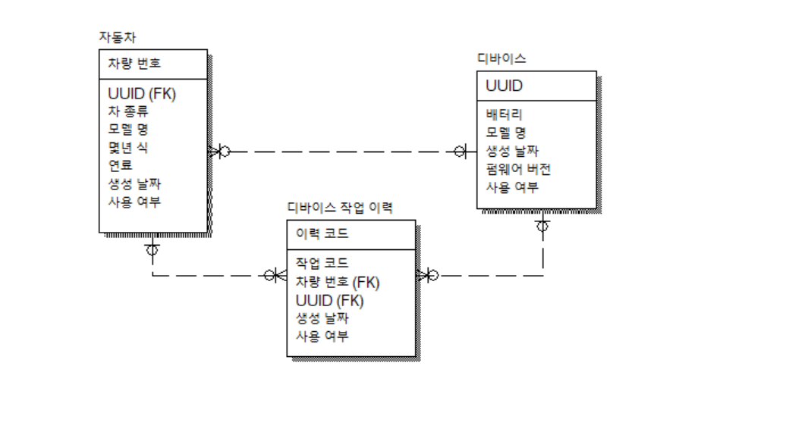

### 02.24일 모델링 연습문제

상원이는 카페를 차렸고, 혼자 카페를 관리하는 DB시스템을 만들려고 한다  
요구 사항

- 고객 데이터는 이름, 연락처, 포인트만 필요하다  
카페 정보,메뉴 정보 데이터는 DB로 관리 X
- 포인트가 1000점이 넘는 고객들은 매달 SMS로 이벤트  
홍보를 보내고 싶고, 그 기록을 DB에 남기고 싶다
- 카페에 들어오는 식자재를 DB로 관리하고 싶다  
언제 들어 왔는지 유통기한은 언제까지인지 등등
- 식자재 거래처도 DB로 관리하고 싶다  

※이때 발주내역도 기록한다고 추가 가정

### 차량 관리 시스템

요구 사항

- 차에 위치 추적 장치(이하 디바이스라 칭함)를 부착해야 한다
- 디바이스는 차량당 1대만 부착할 수 있다
- 디바이스 배터리가 0%가 되면 다른 디바이스로 교체가 된다
- 어떤 차에 어떤 디바이스가 교체 되고 부착되었는지 한눈에 보고 싶다

※이때 요구사항에 교체와 부착로그 모두 필요함

  
- 데이터를 넣어본 엑셀 캡쳐

※선생님이 올려주신 정답

