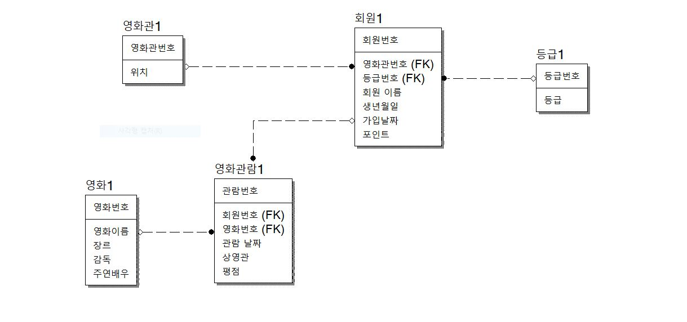
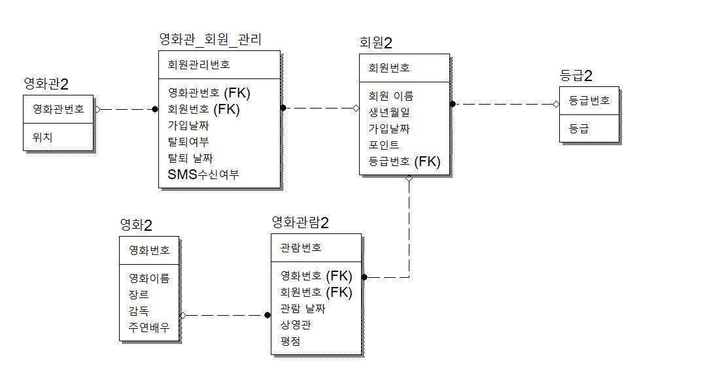
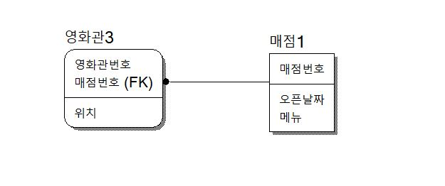
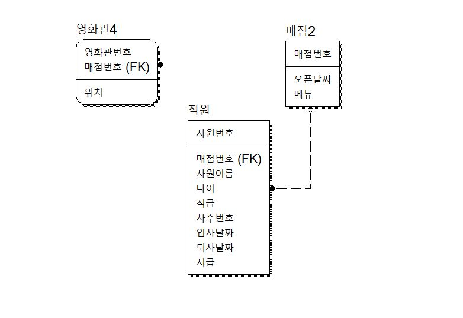
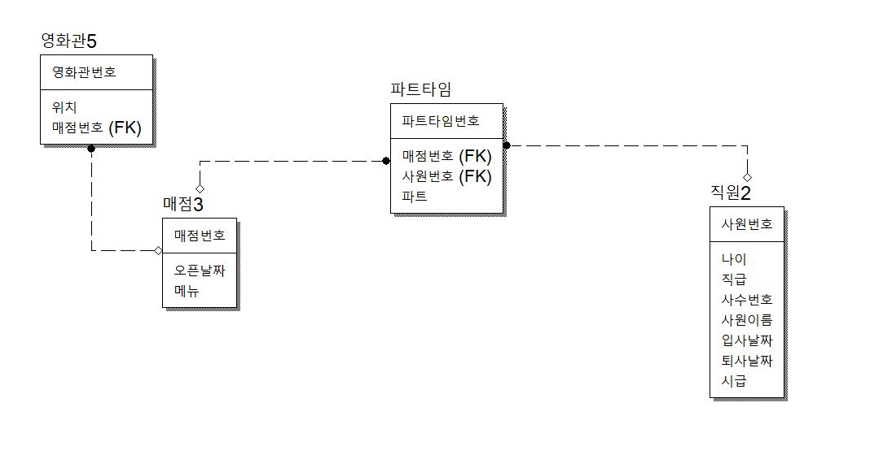

#### 조건 (영화관1번)
- 회원은 여러 영화관에 회원가입할 수 없다 => 회원과 영화관의 관계를 먼저 생각
  - 영화관 테이블에 회원번호가 있으면 다른 회원은 해당 영화관에 가입할 수 없다
  - 회원테이블에 영화관번호가 PK면 다른 회원은 해당 영화관에 가입할 수 없다
  - 회원테이블에 영화관 번호가 FK되어있어야 함
- one to many

#### 조건 (영화관2번)
- 회원은 여러 영화관에 회원가입 할 수 있다
  - 회원은 여러 영화관 선택가능
  - 영화관은 여러 회원을 받을 수 있음
- many to many

#### 조건 (영화관3번)
-  영화관에 매점을 오픈하려고 한다  
하지만, 매점은 오직 하나의 영화관에만 소속될 수 있다  
영화관도 매점 한 개만 오픈 할 수 있다
- one by one

#### 조건 (영화관4번)
- 이제 매점 오픈 됐고 직원을 채용 해야한다  
매점은 여러 직원을 채용할 수 있고, 직원은 이중 취업이 안된다
-  one to many

#### 조건 (영화관5번)
-  직원은 여러 매점에서 일할 수 있다  
매점은 여러 직원을 채용할 수 있다  
ex) 오전 파트는 A매점 오후 파트는 B매점
- many to many

	