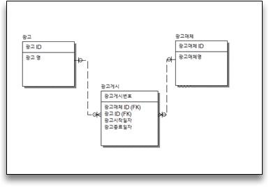

Q.
아래는 어느 회사의 광고에 대한 데이터 모델이다.  
다음 중 광고매체 ID별 최초로 게시한 광고명과  
광고시작일자를 출력하기 위하여 아래 ( )에 들어갈 SQL로 옳은 것은?  



```
SELECT  
FROM 광고게시 A, 광고 B,  광고매체 C  
(                       ) D  
WHERE A.광고시작일자 = D.광고시작일자  
AND A.광고매체ID = D.광고매체ID  
AND A.광고ID = B.광고ID  
AND A.광고매체ID = C.광고매체ID  
ORDER BY C.광고매체 명;  
- 이때 FROM절 A, B, C 보다 괄호 안에있는 서브쿼리(D)가 먼저 실행 됨  
```

1. SELECT D.광고매체ID, MIN(D.광고시작일자) AS 광고시작일자  
FROM 광고게시 D  
WHERE D.광고매체ID = C.광고매체ID  
GROUP BY D.광고매체ID  
- 괄호 안에 있는 걸 D로 칭했는데 괄호 안에서 D를 쓰면 데이터를 찾을 수 없음

2. SELECT 광고매체ID, MIN(광고시작일자) AS 광고시작일자  
FROM 광고게시  
GROUP BY 광고매체ID  
- O

3. SELECT D.광고매체ID, MIN(D.광고시작일자) AS 광고시작일자  
FROM 광고게시 D  
GROUP BY D.광고ID  
- 문제에 광고매체 ID별로 group by 필요 

4. SELECT D.광고매체ID, MIN(D.광고시작일자) AS 광고시작일자  
FROM 광고게시 D  
- 문제에 광고매체 ID별로 group by 필요

###### 정답 : 2번