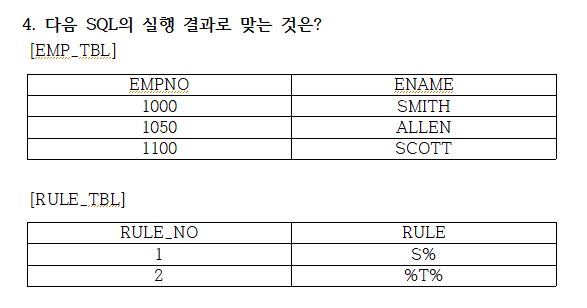
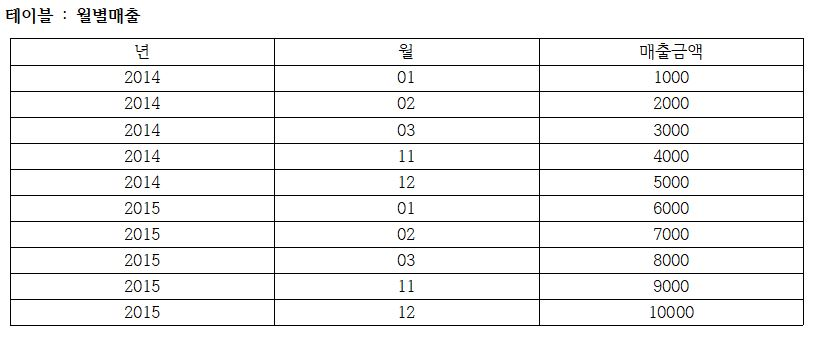

1. 아래 SQLD_D5테이블이 있다고 가정할 때, SELECT 할 때 결과 값은? (주관식)
```
 [TABLE]
 TABLE : SQLD_D5
 COL1 VARCHAR2(30)
 COL2 NUMBER
 [SQL]
 INSERT INTO SQLD_D5(COL1, COL2) VALUES('ABCD',NULL);
 INSERT INTO SQLD_D5(COL1, COL2) VALUES('BC',NULL);
 -- ALTER: DDL중 하나 TABLE 컬럼 속성(이름, 타입, NOT NULL 등등) 변경할 때 사용
 ALTER TABLE SQLD_D5 MODIFY COL2 DEFAULT 10;
 INSERT INTO SQLD_D5(COL1, COL2) VALUES('XY',NULL);
 INSERT INTO SQLD_D5(COL1) VALUES('EXD');
 SELECT SUM(COL2) FROM SQLD_D5;
```
---
2. 아래의 SQL 에 대해서 실행 순서를 올바르게 나열한 것은?
1) FROM -> WHERE -> GROUP BY -> HAVING -> SELECT -> ORDER BY
2) FROM -> WHERE -> GROUP BY -> HAVING -> ORDER BY -> SELECT
3) FROM -> WHERE -> GROUP BY -> HAVING -> SELECT -> ORDER BY
4) FROM -> WHERE -> GROUP BY -> SELECT -> HAVING -> ORDER BY

---
3. 아래와 같은 테이블 TAB1, TAB2 가 있을 때 아래의 SQL의 결과 건수를 알맞게 나열한 것은?
```
SELECT * FROM TAB1 A INNER JOIN TAB2 B ON (A.KEY1 = B.KEY2)
=>교집합 데이터
SELECT * FROM TAB1 A LEFT OUTER JOIN TAB2 B ON (A.KEY1 = B.KEY2)
SELECT * FROM TAB1 A RIGHT OUTER JOIN TAB2 B ON (A.KEY1 = B.KEY2)
SELECT * FROM TAB1 A FULL OUTER JOIN TAB2 B ON (A.KEY1 = B.KEY2)
=>교집합은 하나만 셈
SELECT * FROM TAB1 A CROSS JOIN TAB2 B
hint)　Cross join은 곱집합 (TAB1 4 * TAB2 3) = 12
```
1) 2, 4, 3, 5, 12
2) 2, 4, 5, 3, 12
3) 2, 3, 4, 5, 12
4) 2, 4, 3, 7, 12

---
4. 다음 SQL의 실행 결과로 맞는 것은?  


 ```
 SELECT COUNT(*) CNT
 FROM EMP_TBL A, RULE_TBL B
=>FROM절에 n개 이상의 테이블이 올 수 있음
 WHERE A.ENAME LIKE B.RULE
=>LIKE 문자 찾을 때 사용
=>A LIKE B =>A를 B에 각각 비교
=>WHERE (A.ENAME LIKE ‘S%’) OR (A.ENAME LIKE ‘%T%’)
hint)　S% 앞에 단어가 S로 시작하는 것, %T% 단어에 T가 들어간 것
```
1) 0
2) 2
3) 4
4) 6

---
5. 아래의 쿼리를 만족하는 결과를 가장 잘 설명한 것은?
```
SELECT A.*
FROM HR.EMPLOYEES A, HR.EMPLOYEES B
=> HR(DB이름) =>FROM EMPLOYEES A, EMPLOYEES B 와 같음
=> WHERE절에 INNER JOIN
WHERE 1=1 (그냥 TRUE를 만들기 위해)
AND A.MANAGER_ID = B.EMPLOYEE_ID
=>사원의 사수번호 = 사수의 사원번호
=>사원이 사수번호를 가지고 있으니까  A.MANAGER_ID가 사원번호가 됨
AND B.SALARY >= ANY A.SALARY;
hint) ANY는 IN처럼 다수의 값을 비교할 때 사용.
IN과 다른 점은 비교 연산자를 사용할 수 있다.
hint) MANAGER_ID :사수 번호, EMPLOYEE_ID:사원번호
```
1) 어떤 부하 직원보다도 연봉이 높은 상사
2) 어떤 부하 직원보다도 연봉이 낮은 상사
3) 어떤 상사 보다도 연봉이 높은 부하 직원
4) 어떤 상사 보다도 연봉이 낮은 부하 직원

---
6. 다음 중 데이터베이스 시스템 언어의 종류와 해당되는 명령어를 바르게 연결한 것을 2개 고르시오.
1) DML – SELECT
2) TCL – COMMIT
3) DCL – DROP 
4) DML – ALTER

---
7. 다음 중 NULL의 설명으로 가장 부적절한 것은?
1) 모르는 값을 의미한다.
2) 값의 부재를 의미한다.
3) 공백문자 혹은 숫자 0을 의미한다.
4) NULL과의 모든 비교(IS NULL 제외)는 알 수 없음을 반환한다.

---
8. 아래와 같이 월별매출 테이블에 데이터가 입력되어 있다. 다음 중 2014년 11월부터 
2015년 03월까지의 매출금액 합계를 출력하는 SQL 문장으로 옳은 것은?
```
hint) BETWEEN은 범위를 지정해서 데이터를 조회할 때 사용. 연산자 >= AND <= 같은 결과 나타냄.
```

1)　SELECT SUM(매출금액) AS 매출금액합계   
   FROM 월별매출  
   WHERE 년 BETWEEN ‘2014’ AND ‘2015’  
   AND 월 BETWEEN ‘03’ AND ‘12’  

2)　SELECT SUM(매출금액) AS 매출금액합계   
   FROM 월별매출   
   WHERE 년 IN(‘2014’,‘2015’)  
   AND 월 IN(‘11’,‘12’,‘03’,‘04’,‘05’)  

3)　SELECT SUM(매출금액) AS 매출금액합계   
   FROM 월별매출  
   WHERE (년 = ‘2014’ OR 년 =  ‘2015’)  
   AND (월 BETWEEN ‘01’ AND ‘03’ OR 월 BETWEEN ‘11’ AND ‘12’)

４)　SELECT SUM(매출금액) AS 매출금액합계    
   FROM 월별매출  
   WHERE 년 = ‘2014’ AND 월 BETWEEN ‘11’ AND ‘12’
   OR 년 = ‘2015’ BETWEEN ‘01’ AND ‘03’  
   
---

9. SQL 구문에서 FROM 절에 대한 설명 중 가장 올바르지 않은 것은?
1) FROM 절에 ALIAS를 쓰기 위해서 AS 키워드 사용이 가능하다.
2) FROM 은 가장 먼저 수행 된다.
3) FROM 절에 사용되는 subquery를 보통 inline view 라고 한다.
4) FROM 절은 SELECT 와 항상 짝을 이룬다.
hint) Oracle 에선 from 절에 AS 키워드는 문법 오류. (ANSI 표준에 맞아야 함)

