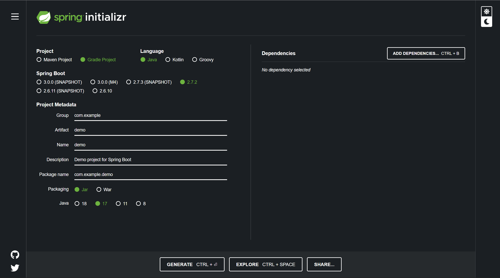
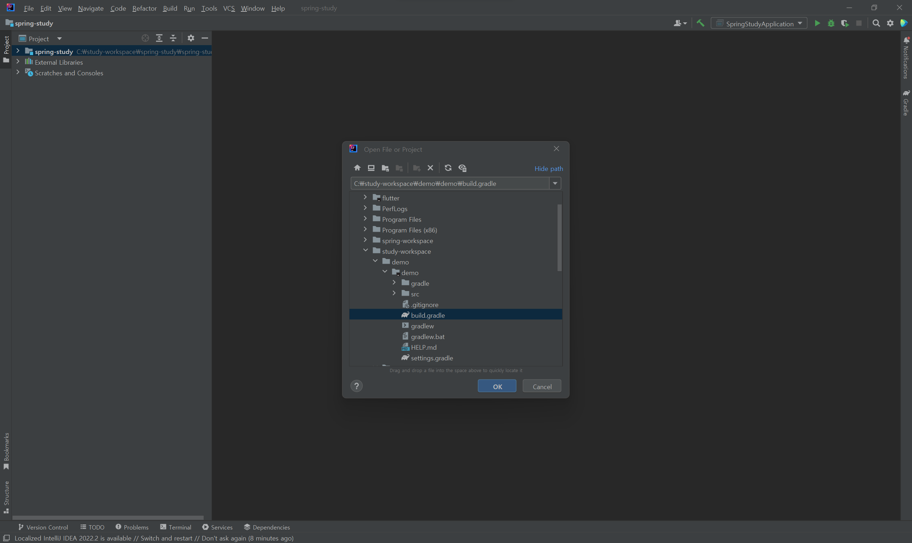

# IntelliJ 
### project 생성
기존 eclipse와 동일하게 spring initializr를 통해 project생성  



- SNAPSHOT : 완성되지 않은 버젼
- Group : 기업명
- Artifact : 결과물 (프로젝트 명)


- open > bulid.gradle

기본 단축키
```
shift + F10 : 실행
shift + F9 : debug

```
thymeleaf html기본 소스
```html
<!DOCTYPE html>
<html lang="en" xmlns:th="http://www.thymeleaf.org">
<head>
    <meta charset="UTF-8">
    <title>Title</title>
</head>
<body>
    <h1 th:text="${name}">Name</h1>
</body>
</html>
```
---

### cmd 창을 통한 build후 실행
cmd 기본 명령어 
```
dir : 현재 경로 파일 확인
cd : 접속

추후 필요한 명령어는 google에 'window cmd 명령어' 검색 
```
spring boot build
```
1. project 폴더 접속
C:\study-workspace\demo\demo>

2. gradlew build 
build 됨

3. libs 접속 후 실행
java -jar (TabKey)

4. 종료는 ctrl + c
```

> 참고 : https://www.youtube.com/user/eyeholys