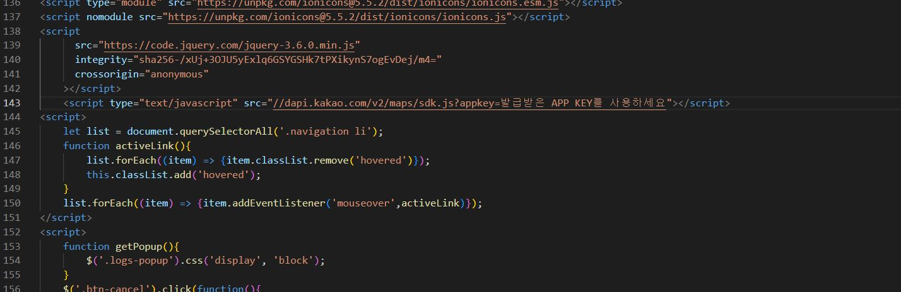

# kakao map 넣기
## 1. kakao developers검색 -> 내 애플리케이션 -> 애플리케이션 추가하기  
-> 앱 이름, 사업자명 입력


## 2. 플랫폼 -> 필요 플랫폼 등록 -> 사이트 도메인에 지도가 필요한 url넣기


```
http://127.0.0.1:5501
http://127.0.0.1:5500
http://127.0.0.1:5502
http://127.0.0.1:5503
http://localhost:8080
```
- 이때 portNum 5500-5503까지는 goLive
- 8080Spring portNum에서 locallhost = 현재 주소  
지도가 필요한 url을 완전 동일하게 써줘야 불러올 수 있음
## 3. Web 사이트 도메인에 맞게 들어갔는지 확인


## 4. 카카오맵api 검색


## 5. 필요한 플랫폼 선택 -> sample


## 6. 마커 생성하기


## 7. script 복사


## 8. 지도가 필요한 script에 붙여넣기



## 9. kakao developers -> 앱키 -> JavaScript키 복사


## 10. '발급받은 APP KEY를 사용하세요'에 붙여넣기


## 11. 카카오맵div복사


## 12. 카카오맵이 필요한 div안에 붙여넣기


## 13. script복사


## 14. script안에 붙여넣기
