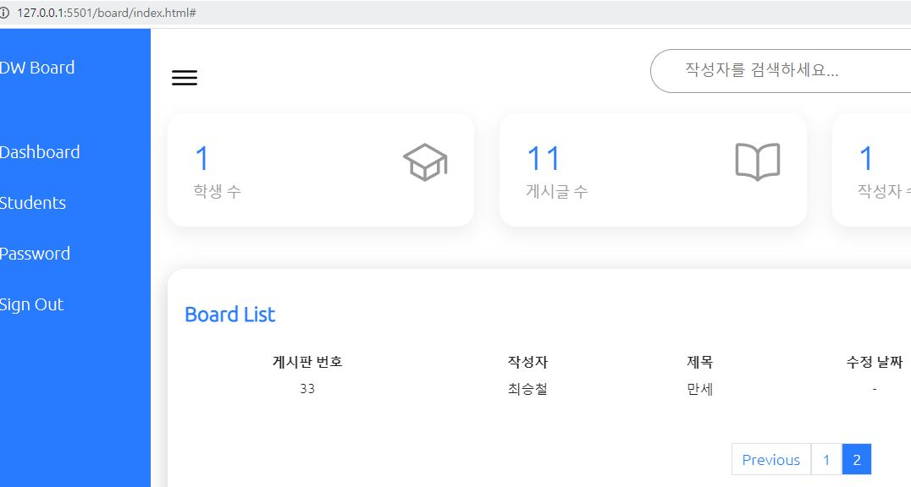

# 페이지 구현
## 1. java
- gradle
```java
	// page handler
	implementation group: 'com.github.pagehelper', name: 'pagehelper-spring-boot-starter', version: '1.4.2'
```
- yaml
```yaml
pagehelper:
   # helper-dialect: 사용할 DB
   helper-dialect: mysql
   # 0페이지 요청이 들어오면 자동으로 1페이지로, 13페이지 까지 있는데 14페이지 요청이 들어오면 자동으로 13페이지로 변환
   reasonable: true
```
- java  
기존에 만들었던 전체 게시물 조회메소드 이용
```java
// controller
@CrossOrigin
@GetMapping("/board")
public PageInfo<Map<String,Object>> callBoardList(@RequestParam("pageNum")int pageNum,	@RequestParam("pageSize")int pageSize){

		List<Map<String, Object>> list = boardService.getAllBoardList(pageNum, pageSize);
		
		return new PageInfo<Map<String,Object>>(list);
	}
```
- new PageInfo : 위에 gradle에서 설정한 미리 만들어진 클래스파일
```java
// service
public List<Map<String,Object>> getAllBoardList(int pageNum, int pageSize){
		PageHelper.startPage(pageNum, pageSize);
		return boardMapper.selectAllBoardList();
	}

// mapper
public List<Map<String,Object>> selectAllBoardList();
```
## 2. js
- html 페이지 div
```html
<div class="pagination">
        <a href="#">Previous</a>
        <a href="#">1</a>
        <a href="#">2</a>
        <a href="#">3</a>
        <a href="#">Next</a>
</div>
```
- js
```js
function getBoardList(pageNum, pageSize){
    $.ajax({
        url : 'http://localhost:8080/api/v1/board?pageNum='+pageNum+'&pageSize='+pageSize,
        type : 'GET',
        dataType : 'json',
        success : function(response){
            console.log(response);
        }
    })
}
```
- 개발자 화면


- navigatepageNums : 페이지 번호
- pageNum : 현재 페이지  
- pageSize : 한 페이지의 최대 게시물 수

```js
var paginationHtml = '';

    if(response.hasPreviousPage){ // 이전 페이지가 true라면
    paginationHtml += '<a onclick="getBoardList('+(response.pageNum-1)+','+pageSize+')" href="#">Previous</a>';
    }

    for(var i=0; i<response.navigatepageNums.length; i++){ //페이지 번호만큼 for문 실행
    // 페이지 번호가 있는 만큼 만들기
    // 다음페이지 눌렀을 때 다음페이지로 넘어가기 onclick으로 구현
    paginationHtml += '<a id="pageNum'+response.navigatepageNums[i]+'" onclick="getBoardList('+response.navigatepageNums[i]+','+pageSize+')" href="#">'+response.navigatepageNums[i]+'</a>';
    }

    if(response.hasNextPage){ // 다음 페이지가 true라면
    paginationHtml += '<a onclick="getBoardList('+(response.pageNum+1)+','+pageSize+')"  href="#">Next</a>';
    }
```
- paginationHtml : 위 div.pagination 안에 주석처리한 a태그를 구현함
---
# ajax페이지 구현의 한계

- postman query String  
http://localhost:8080/api/v1/board?pageNum=1&pageSize=10 입력  

- ajax로 페이지 구현 후 url확인



- queryString으로 표기가 안되어있어서 현재 보고있는 페이지를 알 수 없음  
-> 뒤로가기 -> 1페이지로 감  
- queryString에는 __?pageNum=1&pageSize=10__ 이렇게 history가 남지만  
ajax는 비동기통신으로 history가 남지 않음
- 페이지 구현은 JSP, 리액트, 앵귤러를 사용, history가 필요

---

# other
- ctrl + shift + h : 선택한 단어 전체 replace